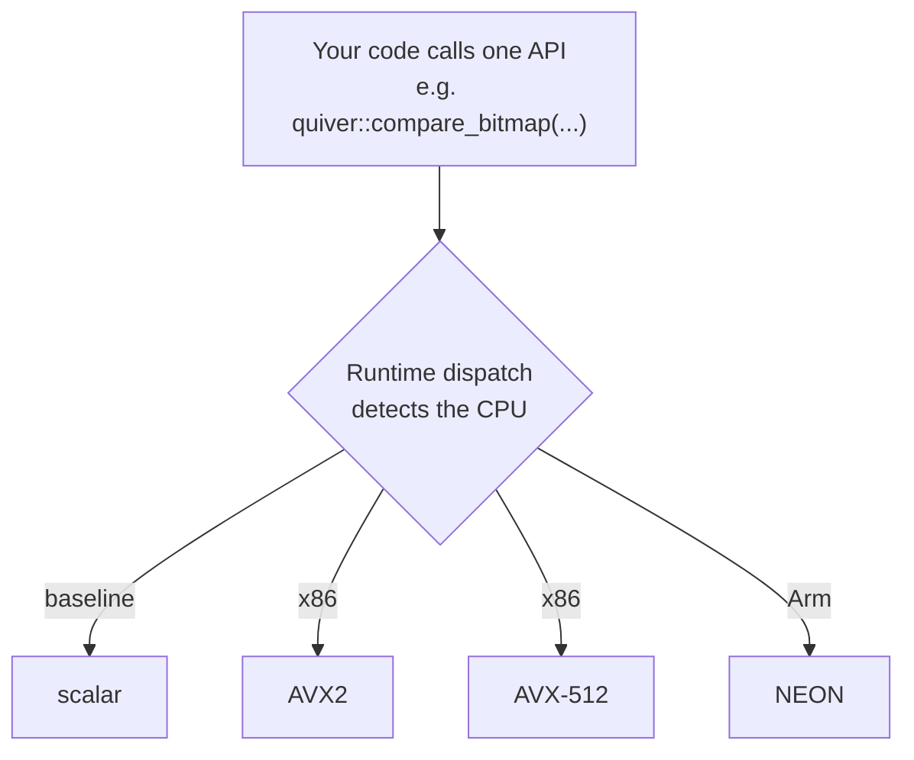

# Quiver

Dependency-free C++23 analytical kernels with runtime SIMD dispatch. Compare, filter, gather,
reduce, hash, and unpack columnar data through one portable API. Quiver selects scalar, AVX2,
AVX-512, or NEON at run time.

[](https://github.com/div0rce/quiver/actions/workflows/ci.yml)
[](https://github.com/div0rce/quiver/releases)
[](LICENSE)


[**Documentation**](https://div0rce.github.io/quiver/) ·
[**Install**](docs/guides/vendoring.md) ·
[**Benchmarks**](ledger/README.md) ·
[**Latest release**](https://github.com/div0rce/quiver/releases/latest)

## Thirty seconds, two files, one command

Grab `quiver.h` + `quiver.cpp` from the [latest release](https://github.com/div0rce/quiver/releases/latest)
(or generate them: `python3 tools/amalgamate/amalgamate.py --out-dir .`), then:

```cpp
// example.cpp
#include "quiver.h"
#include <cstdint>
#include <cstdio>

int main() {
  const std::int64_t values[] = {5, 1, 9, 3, 7, 2};   // a tiny column
  std::uint8_t bits[1] = {0};                          // selection bitmap, 1 bit per row
  std::int64_t kept[6];

  // Which rows are > 4?
  quiver::compare_bitmap(quiver::CompareOp::kGt, quiver::BatchView<std::int64_t>{values, 6},
                         std::int64_t{4}, quiver::BitmapView{nullptr}, bits);
  // Keep those rows, packed together.
  const std::int64_t matched =
      quiver::filter(quiver::BatchView<std::int64_t>{values, 6}, quiver::BitmapView{bits}, kept);
  // Sum what survived (null-aware; no nulls in this toy).
  const std::int64_t sum = quiver::reduce_sum_wrap(quiver::BatchView<std::int64_t>{kept, matched},
                                                   quiver::BitmapView{nullptr});

  std::printf("matched=%lld\nsum=%lld\n", (long long)matched, (long long)sum);
}
```

```sh
c++ -std=c++23 -O3 example.cpp quiver.cpp -o example
./example
```

Expected output:

```
matched=3
sum=21
```

No dependencies, no configuration, no framework. The same two files compile on x86 and Arm; the
right SIMD backend is picked at run time. More complete programs live in [`examples/`](examples/),
a full zero-copy integration beneath Apache Arrow (20M rows, verified against `arrow::compute`)
lives in [`quiver-arrow-example`](https://github.com/div0rce/quiver-arrow-example), and the
[vendoring guide](docs/guides/vendoring.md) covers `find_package`, `FetchContent`, and the drop-in.

## Everyone rebuilds this. Nobody enjoys it.

Compare a column. Filter the rows that pass. Build a mask. Gather values. Sum a column. Hash a
batch of keys. Unpack bit-packed integers. Add two columns without silently overflowing.

Every query engine, every columnar store, every dataframe library needs these. They sound trivial.
Making them *fast* is not. The fast version is different on every CPU, so teams write the SSE one,
then the AVX2 one, then the AVX-512 one, then the Arm NEON one, chase the off-by-one in the tail
loop, discover the results differ across machines, and quietly give up on ever measuring it
honestly.

Quiver does that layer once, carefully, per CPU, and hides it behind one plain call:



## The ten building blocks

| Operation | What it does |
|---|---|
| compare | Test a column against a value or range, into a bitmask or a list of matching row indices |
| filter | Keep the selected rows, packed together |
| select | Convert between the two ways to represent a selection (bitmask and index list) |
| mask | Combine, invert, and count validity or selection bitmasks |
| take / dict decode | Gather values at given indices, including dictionary-encoded columns |
| reduce | Sum, min, max, and moving average over a column, honoring nulls |
| hash | Hash a batch of keys with a fixed, cross-platform hash |
| unpack | Expand bit-packed integers back to full width |
| arithmetic | Add, subtract, multiply columns with defined wrap-around |
| guarded arithmetic | The same, but reporting overflow or saturating instead of wrapping |

Integer and hash results are identical across CPUs. Floating-point sums follow one documented
reassociation policy, so a result is reproducible for a given version, CPU, and build.

## Measured evidence (one machine, stated plainly)

From the committed, reproducible benchmark ledger — Apple M2, dispatched backend versus the
autovectorized scalar baseline, both shipped code:

| Operation | Speedup |
|---|---|
| select: bitmap → indices | **5.0–7.4×** |
| sub-byte bit-unpack (w=1..7) | **6.9–11.0×** |
| float sum / float min | **4.0–7.9×** |
| checked / saturating arithmetic | **1.4–1.7×** |
| filter selected values | **1.6–1.8×** |
| narrow compare (i8/i16/i32) | **1.1–2.9×** |
| 64-bit compare bitmap, 8-byte arith, integer min | parity, on purpose¹ |

¹ Where the compiler's autovectorized code measured faster than handwritten NEON, Quiver routes to
it and says so — the losing measurements stay published.

**Apple M2 only. These are not universal cross-CPU claims.** One machine is registered so far; the
ledger methodology (fresh process per repetition, CV gate, no unverifiable numbers) and every entry
behind the table are in [`ledger/`](ledger/README.md). Registering an x86 machine is the single
most valuable contribution — see [contributing](CONTRIBUTING.md).

## Support matrix

Three different claims, kept distinct: *compiles*, *correctness-tested*, and *performance-measured*.

| Platform | Scalar | AVX2 | AVX-512 | NEON | Performance evidence |
|---|---|---|---|---|---|
| Linux x86-64 | tested | tested | tested (Intel SDE emulator) | — | pending native machines |
| macOS ARM64 | tested | — | — | tested | **Apple M2 ledger** |
| Linux ARM64 | tested | — | — | tested | pending |
| Windows x86-64 | tier-2² | tier-2² | tier-2² | — | pending |

² MSVC builds and passes the amalgamation suite in CI with documented exclusions; tier-1 promises
are made only for GCC/Clang.

## Why Quiver (and when not)

| Need | Quiver | Full engine (DuckDB, ClickHouse) | General SIMD library |
|---|---|---|---|
| Analytical kernels, ready made | yes | yes (internal) | you implement them |
| SQL / planner / storage | no, by design | yes | no |
| Runtime ISA dispatch | yes | usually internal | varies |
| Dependency-free two-file drop-in | yes | no | varies |
| Public reproducible benchmark ledger | yes | rarely standalone | usually no |

Already on DuckDB, Arrow, Velox, or ClickHouse? You probably do not need Quiver — they live one
layer up. Building your own engine, store, or dataframe layer and want only the fast primitives?
That is the gap. No performance comparison against those systems is claimed anywhere: they were
not measured.

**Not for you if** you need a database, GPU/distributed/streaming execution, or a general
vector-math toolkit. Quiver is a fixed, closed set of analytical operations.

## Status

- **Current release: [v0.7.0](https://github.com/div0rce/quiver/releases/latest).** All ten
  operation groups on scalar + AVX2 + NEON natively; AVX-512 correctness-verified under Intel SDE.
  The public API is frozen and audited.
- **The release pipeline is live**: a tag runs the full gate plus the nightly suite (differential
  cross product, 4.5 h fuzz, MSan/LSan) and publishes the two-file drop-in with checksums and
  build provenance.
- **Road to v1.0 is evidence, not features**: register more benchmark machines (x86 AVX2/AVX-512,
  more Arm), fill the cross-CPU record, run the release regression gates on ≥2 machines. The plan:
  [hardware coverage](docs/benchmarks/hardware-coverage-plan.md).

## Documentation and background

- [Documentation site](https://div0rce.github.io/quiver/) — install, quickstart, API reference,
  performance record
- [Performance ledger](ledger/README.md) and the [benchmark methodology](docs/benchmarks/methodology.md)
- [Contributing](CONTRIBUTING.md) — including the two highest-value contributions: hardware
  benchmark submissions and package-manager ports
- Project internals: [Design Charter](docs/design/DESIGN_CHARTER.md) ·
  [Engineering PRD](docs/prd/README.md) · [ADRs](docs/adr/README.md) ·
  [status report](docs/releases/final-implementation-report.md)

## License

[Apache-2.0](LICENSE).
