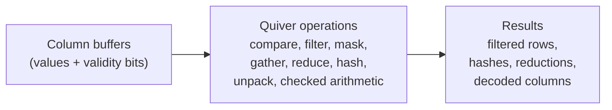
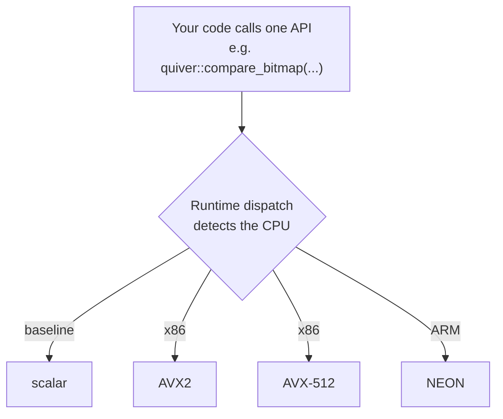

# Quiver

[](https://github.com/div0rce/quiver/actions/workflows/ci.yml)
[](LICENSE)


[](https://github.com/div0rce/quiver/tags)

**Quiver is a small C++23 library of fast analytical building blocks used inside database-style engines.**

## The problem it solves

Analytical systems (query engines, columnar stores, dataframe libraries) reimplement the same
low-level operations over and over: compare values against a threshold, filter rows, build and
combine bitmasks, gather selected values, reduce a column to a sum or min or max, hash keys,
unpack bit-packed integers, and do arithmetic that checks for overflow. These operations are
simple to describe and surprisingly hard to make fast, because the fast version is different on
every CPU (SSE/AVX2 on older Intel and AMD, AVX-512 on newer x86, NEON on Arm).

Quiver implements that shared layer once, carefully, for each CPU family, and hides the choice
behind one plain API. You call `compare` or `filter` or `hash`; Quiver runs the right version for
the machine it is on. No dependencies, no runtime, no framework to adopt.



One public call picks the best implementation the CPU supports, at run time:



## At a glance

- **10 operation groups** covering the common analytical primitives.
- **4 CPU tiers**: scalar, AVX2, NEON, AVX-512.
- **3 ways to consume it**: an installed CMake package, a source subproject, or a single-file drop-in.
- **Current release: v0.6.0.** The library is feature-complete for its planned surface.
- **Zero dependencies.** C++23, builds with CMake 3.28 or newer.

## The ten building blocks

| Operation | What it does |
|---|---|
| compare | Compare a column against a value or range, producing a bitmask or a list of matching row indices |
| filter | Keep only the selected rows, packed together |
| select | Convert between the two ways of representing a selection (a bitmask and a list of indices) |
| mask | Combine, invert, and count validity or selection bitmasks |
| take / dictionary decode | Gather values at given indices, including decoding dictionary-encoded columns |
| reduce | Sum, min, max, and simple moving average over a column, honoring null values |
| hash | Hash a batch of keys with a fixed, cross-platform hash |
| unpack | Expand bit-packed integers back to full width |
| arithmetic | Add, subtract, multiply columns with defined wrap-around behavior |
| guarded arithmetic | The same arithmetic, but reporting overflow or saturating instead of wrapping |

## What works today

All ten operations are implemented and tested on scalar, AVX2, and NEON. The AVX-512 versions
are implemented and their correctness is checked in continuous integration using Intel's CPU
emulator (SDE), because the project does not yet have physical AVX-512 hardware to run on. A few
operations deliberately reuse the AVX2 version on AVX-512 machines where a separate AVX-512
version would not be faster; those choices are documented.

Results are identical across CPUs for integer and hash operations. Floating-point sums follow a
single documented reassociation policy, so the result is reproducible per (version, CPU, build).

## How to try it

```sh
git clone https://github.com/div0rce/quiver && cd quiver
cmake --preset dev
cmake --build --preset dev
ctest --preset dev
```

A minimal example (compare a column, then keep the matching values):

```cpp
#include "quiver/quiver.h"
#include <cstdint>
#include <cstdio>

int main() {
  const int v[] = {5, 1, 9, 3, 7};
  std::uint8_t bits[1] = {0};                 // one bit per element
  int out[5];

  // Which elements are greater than 4?
  quiver::compare_bitmap(quiver::CompareOp::kGt, quiver::BatchView<int>{v, 5}, 4,
                         quiver::BitmapView{nullptr}, bits);
  // Pack those elements to the front of `out`.
  const auto kept = quiver::filter(quiver::BatchView<int>{v, 5}, quiver::BitmapView{bits}, out);

  std::printf("kept %lld values\n", (long long)kept);   // kept 3 values: 5 9 7
}
```

More runnable programs live in [`examples/`](examples/). Ways to add Quiver to your own build
(CMake package, `FetchContent`, or the single-file drop-in) are in the
[vendoring guide](docs/guides/vendoring.md).

## When to use Quiver

- You are building a query engine, columnar store, or dataframe layer and want vetted, fast
  versions of these primitives without writing per-CPU SIMD yourself.
- You want a small dependency-free component you can vendor, including as two files you drop into
  an existing build.
- You want the same numeric results on x86 and Arm for integer and hash operations.
- You are learning how portable SIMD, runtime dispatch, and columnar kernels fit together and
  want a real, tested codebase to read.

## When not to use Quiver

- You need a database or query engine, not building blocks. Quiver has no SQL, no query planner,
  no scheduler, no storage, and no networking, and it is not going to grow them.
- You need GPU execution, distributed execution, or streaming operators.
- You want a general SIMD abstraction layer for arbitrary math. Quiver is a fixed, closed set of
  analytical operations, not a vector-math toolkit.

## Why not just use DuckDB, Arrow, Velox, or ClickHouse?

Those are excellent, and they are a different layer. DuckDB and ClickHouse are full engines you
run; Arrow and Velox are large frameworks you build on. Quiver is the small layer underneath all
of them: the individual operations, with no engine, no format lock-in, and no dependency to pull
in. If you already use one of those systems, you probably do not need Quiver. If you are building
something of your own and want just the fast primitives, that is the gap Quiver fills. It also
publishes an honest, reproducible measurement record for those primitives, which those projects do
not expose as a standalone artifact.

## Current benchmark evidence

Quiver ships with a measurement harness and a versioned results record (a "ledger") built around
reproducibility: fresh process per run, shuffled repetitions, statistical confidence intervals,
and a strict rule that noisy or unverifiable runs are not published.

Today there is real measured data from **one** registered machine, an Apple M2 (a secondary,
lower-priority platform without hardware performance counters). That evidence is real, but it is a
single CPU. Broad, cross-CPU performance claims are **not** made yet, and no numbers are invented
to fill the gap.

## What is still pending

- **The public benchmark story is not finished until more CPUs are registered.** Cross-CPU
  performance conclusions and the AVX-512 performance numbers wait on registered x86 and additional
  Arm hardware. The plan for closing this is in
  [docs/benchmarks/hardware-coverage-plan.md](docs/benchmarks/hardware-coverage-plan.md).
- **Release artifacts are not attached to v0.6.0 yet.** The automated release workflow exists and
  is validated, but it correctly refuses to publish while one nightly sanitizer job (a from-source
  instrumented-standard-library build) is broken. Until that is fixed, generate the single-file
  drop-in locally with `python3 tools/amalgamate/amalgamate.py --out-dir <dir>`.

## Road to v1.0

The public API is frozen and audited (the signatures in the headers, the reference docs, and the
spec all agree). What stands between today and a 1.0 release is evidence, not features: register a
few more benchmark machines, fill in the cross-CPU performance record, fix the one broken nightly
job so releases can attach artifacts, and run the release-candidate checks on more than one
machine. None of that changes the code you would call.

## Documentation and background

- [Documentation home](docs/README.md) and the [status report](docs/releases/final-implementation-report.md)
- [Design Charter](docs/design/DESIGN_CHARTER.md) (what Quiver is and is not) and the
  [Engineering PRD](docs/prd/README.md) (the full engineering specification)
- [Architecture Decision Records](docs/adr/README.md), the [performance ledger](ledger/README.md),
  and [contributing](CONTRIBUTING.md)

## License

[Apache-2.0](LICENSE).
