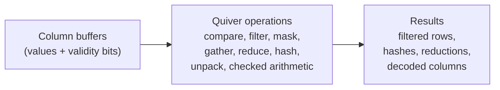
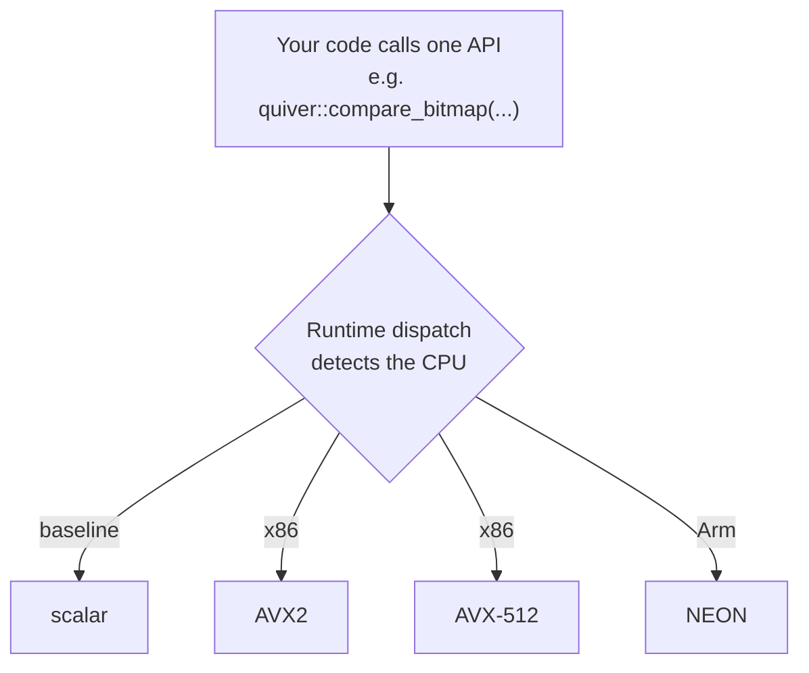

# Quiver

[](https://github.com/div0rce/quiver/actions/workflows/ci.yml)
[](LICENSE)


[](https://github.com/div0rce/quiver/tags)

**Quiver is a small C++23 library of fast analytical building blocks used inside database-style engines.**

## Everyone rebuilds this. Nobody enjoys it.

Compare a column. Filter the rows that pass. Build a mask. Gather values. Sum a column. Hash a
batch of keys. Unpack bit-packed integers. Add two columns without silently overflowing.

Every query engine, every columnar store, every dataframe library needs these. They sound trivial.
Making them *fast* is not. The fast version is different on every CPU, so teams write the SSE one,
then the AVX2 one, then the AVX-512 one, then the Arm NEON one, chase the off-by-one in the tail
loop, discover the results differ across machines, and quietly give up on ever measuring it
honestly.

Quiver does that layer once, carefully, per CPU, and hides it behind one plain call. You write
`compare` or `filter` or `hash`. Quiver runs the right code for the machine underneath. No
dependencies. No runtime. No framework to adopt.



One call. Quiver detects the CPU and picks the fastest version it supports, at run time:



## At a glance

- **10 operation groups** covering the common analytical primitives.
- **4 CPU tiers**: scalar, AVX2, NEON, AVX-512.
- **3 ways to consume it**: an installed CMake package, a source subproject, or a single-file drop-in.
- **Current release: v0.6.0.** Feature-complete for its planned surface.
- **Zero dependencies.** C++23, builds with CMake 3.28 or newer.

## The ten building blocks

| Operation | What it does |
|---|---|
| compare | Test a column against a value or range, into a bitmask or a list of matching row indices |
| filter | Keep the selected rows, packed together |
| select | Convert between the two ways to represent a selection (bitmask and index list) |
| mask | Combine, invert, and count validity or selection bitmasks |
| take / dict decode | Gather values at given indices, including dictionary-encoded columns |
| reduce | Sum, min, max, and moving average over a column, honoring nulls |
| hash | Hash a batch of keys with a fixed, cross-platform hash |
| unpack | Expand bit-packed integers back to full width |
| arithmetic | Add, subtract, multiply columns with defined wrap-around |
| guarded arithmetic | The same, but reporting overflow or saturating instead of wrapping |

## What works today

All ten operations run on scalar, AVX2, and NEON, natively and tested. The AVX-512 versions are
written and their correctness is checked in CI on Intel's CPU emulator (SDE), because there is no
AVX-512 hardware to run on yet. A few operations reuse the AVX2 version on AVX-512 machines where a
separate one would not be faster; those choices are documented.

Integer and hash results are identical across CPUs. Floating-point sums follow one documented
reassociation policy, so a result is reproducible for a given version, CPU, and build.

## Try it in 30 seconds

```sh
git clone https://github.com/div0rce/quiver && cd quiver
cmake --preset dev
cmake --build --preset dev
ctest --preset dev
```

Compare a column, then keep the values that passed:

```cpp
#include "quiver/quiver.h"
#include <cstdint>
#include <cstdio>

int main() {
  const int v[] = {5, 1, 9, 3, 7};
  std::uint8_t bits[1] = {0};                 // one bit per element
  int out[5];

  quiver::compare_bitmap(quiver::CompareOp::kGt, quiver::BatchView<int>{v, 5}, 4,
                         quiver::BitmapView{nullptr}, bits);            // which are > 4?
  const auto kept = quiver::filter(quiver::BatchView<int>{v, 5}, quiver::BitmapView{bits}, out);

  std::printf("kept %lld values\n", (long long)kept);                  // kept 3 values: 5 9 7
}
```

More programs in [`examples/`](examples/). Adding Quiver to your build (CMake package,
`FetchContent`, or the single-file drop-in) is in the [vendoring guide](docs/guides/vendoring.md).

## When to reach for Quiver

- You are building a query engine, columnar store, or dataframe layer and want vetted, fast
  primitives without hand-writing SIMD for four instruction sets.
- You want a tiny dependency-free piece you can vendor, down to two files dropped into your build.
- You need the same integer and hash results on x86 and Arm.
- You want a real, tested codebase to learn portable SIMD, runtime dispatch, and columnar kernels from.

## When not to

- You need a database or a query engine. Quiver has no SQL, planner, scheduler, storage, or
  networking, and it will not grow them.
- You need GPU, distributed, or streaming execution.
- You want a general vector-math abstraction. Quiver is a fixed, closed set of analytical
  operations, not a SIMD toolkit.

## Why not just use DuckDB, Arrow, Velox, or ClickHouse?

Because they live one layer up. DuckDB and ClickHouse are engines you run. Arrow and Velox are
frameworks you build on. Quiver is the small layer under all of them: the individual operations,
with no engine, no format lock-in, and nothing to pull in. Already on one of those? You probably do
not need Quiver. Building your own thing and want only the fast primitives? That is the gap. Quiver
also publishes an honest, reproducible measurement record for these operations, which none of them
ships as a standalone artifact.

## Current benchmark evidence

Quiver ships a measurement harness and a versioned results record (a "ledger") built for
reproducibility: a fresh process per run, shuffled repetitions, confidence intervals, and a hard
rule that noisy or unverifiable runs are not published.

Right now there is real data from exactly **one** registered machine, an Apple M2 (a secondary,
lower-priority platform with no hardware performance counters). That evidence is real, but it is one
CPU. Broad cross-CPU speed claims are **not** made here, and nothing is invented to fill the gap.

## What is still pending

- **The benchmark story is not finished until more CPUs are registered.** Cross-CPU conclusions and
  the AVX-512 numbers wait on registered x86 and additional Arm hardware. The plan is in
  [docs/benchmarks/hardware-coverage-plan.md](docs/benchmarks/hardware-coverage-plan.md).
- **v0.6.0 has no attached download yet.** The release automation exists and is validated, but it
  correctly refuses to publish while one nightly sanitizer job (a from-source instrumented
  standard-library build) is broken. Until it is fixed, build the single-file drop-in locally with
  `python3 tools/amalgamate/amalgamate.py --out-dir <dir>`.

## Road to v1.0

The public API is frozen and audited: the headers, the reference docs, and the spec all agree.
What stands between here and 1.0 is evidence, not features. Register a few more benchmark machines,
fill in the cross-CPU record, fix the one broken nightly job so releases can attach files, and run
the release checks on more than one machine. None of it changes the code you would call.

## Documentation and background

- [Documentation home](docs/README.md) and the [status report](docs/releases/final-implementation-report.md)
- [Design Charter](docs/design/DESIGN_CHARTER.md) (what Quiver is and is not) and the
  [Engineering PRD](docs/prd/README.md) (the full engineering specification)
- [Architecture Decision Records](docs/adr/README.md), the [performance ledger](ledger/README.md),
  and [contributing](CONTRIBUTING.md)

## License

[Apache-2.0](LICENSE).
