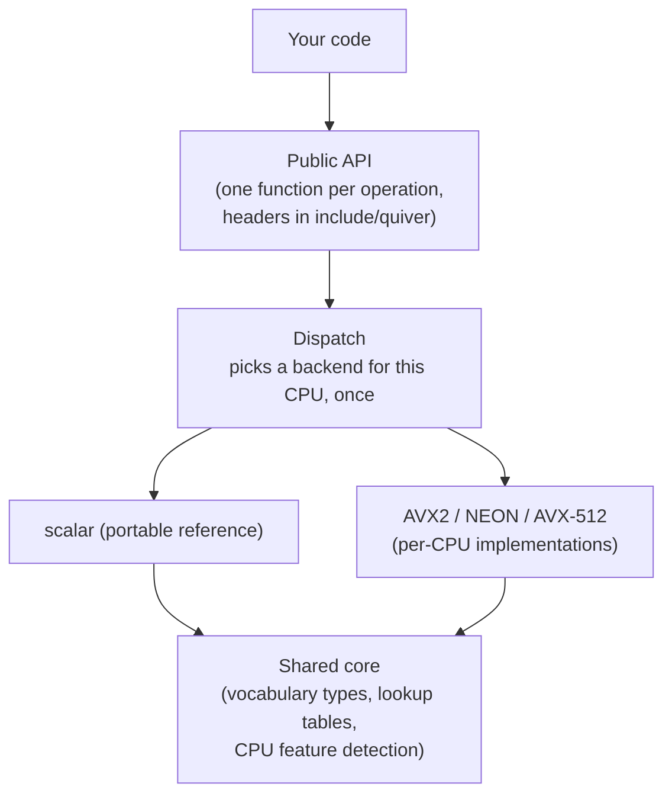

# Architecture pages

This section explains how Quiver is put together, one module at a time. If you
just want to use the library, the [project README](https://github.com/div0rce/quiver#readme) and the
[guides](../guides/getting-started.md) are enough. Read on if you want to understand or change the
internals.

The shape of the library, from your call to the CPU code that runs:

Each page below covers one module: what it is for, what it must not do, its interfaces and
dependencies, its memory and threading model, and how it can fail. The
[module map](module-map.md) lists every module and its owner.

## Traceability

Module pages mirror the internal architecture and kernel-design specifications
([PRD 05](../prd/05-internal-architecture.md), [PRD 08](../prd/08-kernel-design.md)); the page
template and the required sections are set by REQ-DOC-003. Each page belongs to its module's owner.
