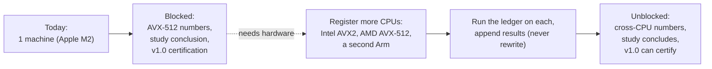

# Hardware coverage plan: closing R-06

The ledger currently holds **one** registered machine (Apple M2, a secondary, no-PMU platform).
That single-µarch state (risk **R-06** / REQ-LEDGER-012) is the one blocker behind three otherwise-
complete deliverables. This page is the concrete plan to close it. It changes no conclusions on its
own, it says exactly what evidence is missing and how to add it without rewriting what exists.



## What is blocked

| Deferred | Why it needs more machines |
|----------|----------------------------|
| AVX-512 performance ledger (M7) | correctness is SDE-proven, but there is no AVX-512 silicon to measure |
| M9 representation-study conclusion | the bitmap-vs-selvec crossover is cross-µarch by design; one ISA can't answer it (gate M9) |
| M10 v1.0 certification | Charter §9.1 needs the ≥5-µarch coverage gate and a regression subset on ≥2 machines |

## Machines needed

REQ-LEDGER-012 calls for ≥5 microarchitectures across ≥3 ISAs; the registry has 1. **Minimum useful
set to unblock** (each a distinct, widely-deployed µarch spanning the shipped ISAs):

- **Intel x86 with AVX2** (e.g. a Golden-Cove-class part), the mainstream AVX2 baseline.
- **AMD x86 with AVX-512** (Zen 4/5), the first *measured* AVX-512 numbers (today AVX-512 is
  SDE-correctness-only).
- **A second ARM µarch** (e.g. AWS Graviton 3/4), cross-validates the Apple M2 NEON numbers on a
  different ARM implementation.

Registered machines only, **CI runners are prohibited as ledger sources** (REQ-LEDGER-007); these
must be real, quiescable hosts.

## Procedure per machine

1. **Register** the machine: add `ledger/machines/<machine-id>.json` following the schema of the
   existing `ledger/machines/apple-m2-mba.json` (µarch, CPU model, cores, memory, OS baseline,
   `isa_tiers`, and the `secondary_platform` / `no_pmu` flags where they apply).
2. **Prepare the environment** to pass the REQ-LEDGER-013 checklist (pinned frequency governor,
   isolated core, quiet machine; the runner refuses to publish otherwise). See
   [methodology.md](methodology.md).
3. **Run** the family (and, for the representation study, the `compare` filter):
   ```sh
   python3 ledger/runner/quiver_ledger.py run --machine <machine-id> --filter <pattern>
   ```
   Fresh process per repetition, shuffled order, ≥10 reps, seeded percentile-bootstrap CIs, CV > 5%
   excluded (ADR-020/021). On x86, drive each ISA variant per process via the `QUIVER_ISA` cap.
4. **Commit** the run: it lands append-only under
   `ledger/results/<uarch>/<yyyymmdd>-<shortsha>/{entries.json,raw/,manifest.json}`.
5. **Validate**: `python3 ledger/runner/quiver_ledger.py validate`.

## Append-only, never rewrite

New machines **add** `results/<uarch>/…` directories and `qle:<entry_id>` references; they never
edit prior runs. Corrections supersede via a new dated run, history is not rewritten
(ADR-021). Existing Apple M2 numbers and their verdicts stay exactly as published; cross-µarch
analysis is layered on top once the data exists. Do not move dev-run / indicative / extrapolated
figures into `ledger/results/`, only CV-gated, empty-`deviations` runs are publishable.

## How this unblocks the deferrals

- With AVX-512 silicon registered, the M7 AVX-512 performance ledger fills in (correctness is
  already SDE-proven).
- With ≥3 ISAs across ≥5 µarchs, the M9 study evaluates its pre-registered decision rule and its
  [conclusion](investigations/representation-study/conclusion.md) can finally be drawn.
- With the coverage gate met and a regression subset on ≥2 machines showing no unexplained >3%
  regressions, the M10 v1.0 certification proceeds, the API surface is already frozen-clean, so
  only this evidence stands between v0.6.0 and a v1.0 tag.

Until then, the M9 conclusion and v1.0 certification remain **pending**, and no cross-µarch
performance claim is made anywhere in the repo (Charter T7).

*Traceability: R-06, REQ-LEDGER-012 (M10-owned), REQ-LEDGER-007/-013; gates M5/M9/M10.*
