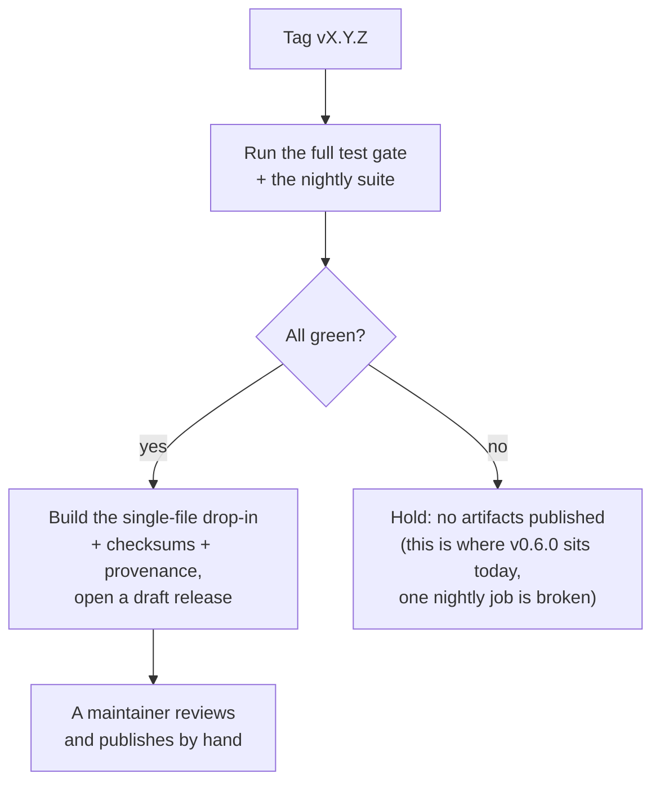

# Releases and gates

This is the paper trail. Each release has notes, and each step of the project has
a "gate" record: a short, honest report of what was done, what passed, and what was deliberately
left for later. If you want to know exactly how far along Quiver is and why, the
[status report](final-implementation-report.md) is the best single page; the gate records are the
detail behind it.

What happens when a version is tagged:

Release notes follow a fixed template; gate records under `gates/` are the auditable trail of every
release checklist. Start of the trail: [gates/M0.md](gates/M0.md). Owner: maintainer.

## Traceability

Release-note template: REQ-DOC-010. Gate records: REQ-MS-002. The tag-driven flow above is the
`release.yml` workflow (REQ-CI-009); the "hold" branch is why v0.6.0 has no attached files yet
(risk R-19).
