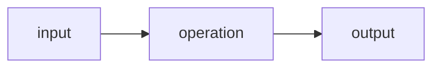

# Documentation style guide

This page is the house style for Quiver's documentation. It exists so a
first-time reader can understand a page without having read the internal specification first, and
so every number and claim in the docs can be traced to something real. Follow it when you write or
edit any Markdown file in this repo.

## Two layers of docs

Quiver has public-facing docs (the README, guides, API reference, benchmark pages) and internal
docs (the engineering specification, the decision records, module architecture). Both must be
readable; they differ only in where the rigor goes.

- **Public docs** explain the user's problem first, then the solution. Internal identifiers and
  cross-references belong in a short "Traceability" section near the end, not in the opening.
- **Internal docs** may keep their precise, identifier-heavy language, but must open with a short 
  summary (2 to 5 sentences) that says what the page is about in ordinary words.

## Rules

1. **No em dashes.** Do not use the long dash. Use commas, periods, parentheses, or a simple
   hyphen with spaces. (This keeps a consistent voice and avoids a common AI-writing tell.)
2. **Explain the problem before the implementation.** Say what a reader wants to do before naming
   the mechanism that does it.
3. **Every technical page needs a summary near the top.** A few sentences a
   non-specialist can follow.
4. **Explain an abbreviation on first use.** Write the words out once, then use the short form.
5. **Every number must be sourced.** Counts, versions, and measurements must come from the code,
   CI, committed docs, or a committed ledger entry. If you cannot point to the source, do not
   write the number.
6. **Every claim must be backed** by code, CI, docs, or a ledger entry. Soften or mark as pending
   anything you cannot back.
7. **No invented evidence.** No fake adoption, users, stars, or benchmark numbers. No
   generalizing a single machine's numbers into a cross-CPU claim. No implying v1.0 readiness
   before its criteria are met.
8. **Keep deferrals honest and plain.** Explain what is not done and why in normal language; do
   not hide it or bury it in jargon.
9. **Prefer Mermaid diagrams over ASCII diagrams.** Diagrams render on GitHub and on the docs
   site. Use a fenced `mermaid` code block.
10. **Make tables readable.** Short cells. If a cell becomes a paragraph, use prose or a list
    instead.
11. **Traceability stays at the bottom of public pages.** Internal identifiers (requirement IDs,
    decision-record IDs, gate references) are kept for auditability, but they do not open a
    public page.

## Mermaid example

````markdown

````

## Applying this to existing docs

The README and the top-level public docs follow this guide. The deeper internal specification and
decision records are being brought into line in follow-up passes; until then they remain accurate
but denser than this guide prefers. See the follow-up checklist in the pull request that
introduced this guide.
